# 🚀 Cloud-Native Medallion Architecture for Scalable Predictive Analytics using Snowflake


---

## 📌 Overview

This project demonstrates a **complete end-to-end cloud data engineering and machine learning pipeline** using:

- **Snowflake Medallion Architecture (Bronze → Silver → Gold)**
- **Automated Data Pipelines using Snowflake Tasks**
- **Machine Learning Model Training & Comparison**
- **Interactive Streamlit Dashboard**
- **Closed-loop Prediction Storage**

The system is designed to simulate a **modern production-grade data platform** for scalable analytics and predictive modeling.

---

## 🧠 Architecture

Raw Data
↓
BRONZE (Raw Ingestion)
↓
SILVER (Cleaned & Transformed)
↓
GOLD (Aggregated Analytics Table)
↓
Python ML Pipeline
↓
Model Training & Evaluation
↓
Best Model Selection
↓
Streamlit Dashboard
↓
User Prediction Input
↓
Predictions stored in Snowflake

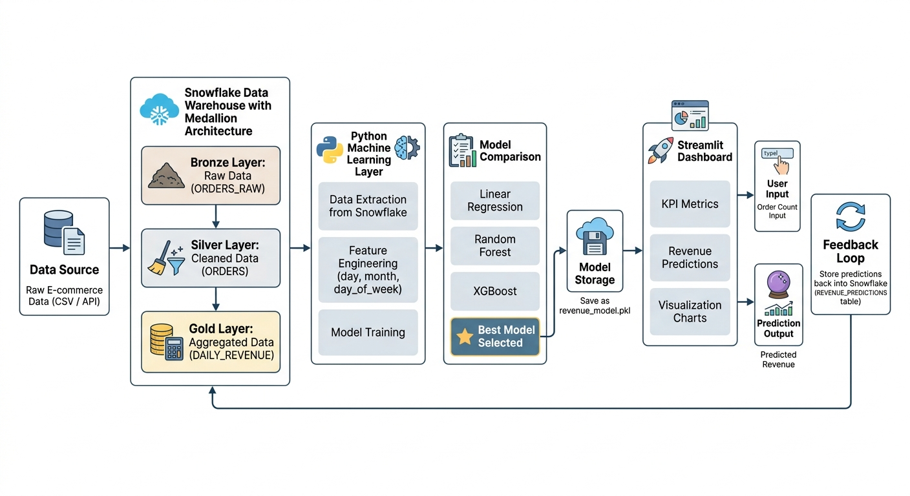

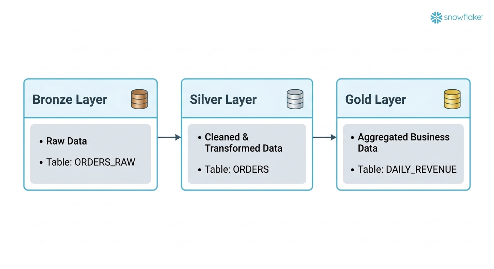

---

## ⚙️ Tech Stack

| Layer | Technology |
|------|----------|
Data Warehouse | Snowflake |
Data Pipeline | SQL (Medallion Architecture) |
Automation | Snowflake Tasks |
ML Models | Scikit-learn, XGBoost |
Backend | Python |
Visualization | Streamlit |
Storage | CSV + Snowflake |

---

## 📊 Key Features

- ✅ End-to-end data pipeline (Bronze → Silver → Gold)
- ✅ Automated transformations using Snowflake Tasks
- ✅ Feature engineering for time-series prediction
- ✅ Model comparison:
  - Linear Regression
  - Random Forest
  - XGBoost
- ✅ Evaluation metrics:
  - R² Score
  - MAE
  - RMSE
- ✅ Best model selection & persistence
- ✅ Real-time prediction interface
- ✅ Predictions written back to Snowflake
- ✅ Automated ML retraining trigger

---

## 📈 Model Performance

| Model | R² Score | MAE | RMSE |
|------|--------|------|------|
Linear Regression | 0.949 | 2635 | 3697 |
Random Forest | 0.678 | 3567 | 9316 |
XGBoost | 0.692 | 3804 | 9103 |

🏆 **Best Model: Linear Regression**

---

## 🤖 Model Comparison


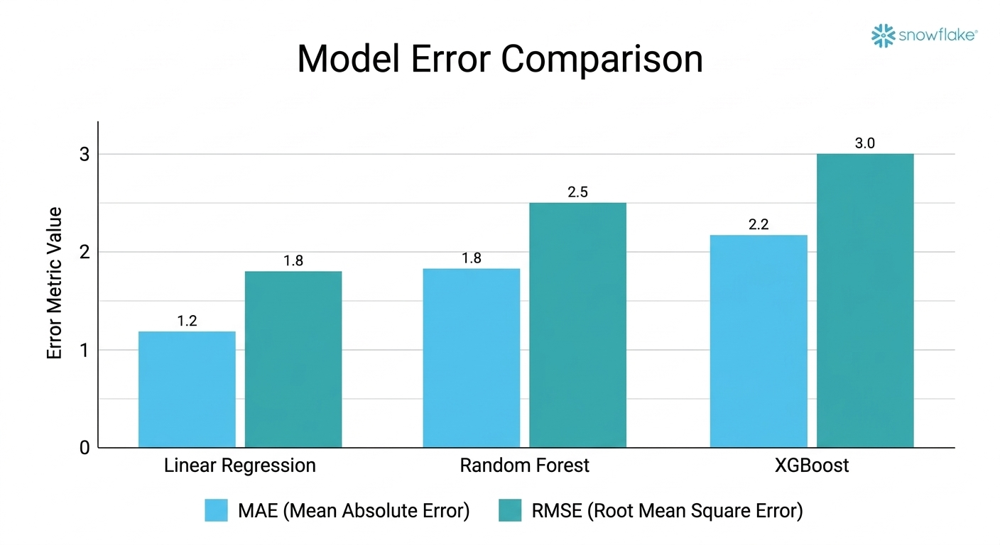

 ---
 
## 📊 Dashboard Features

- 📌 KPI Metrics (Revenue, Orders)
- 📈 Actual vs Predicted Revenue
- 📊 Orders vs Revenue Analysis
- 📉 Feature Importance Visualization
- 🤖 Real-time Revenue Prediction Tool

---

## 📌 Feature Importance

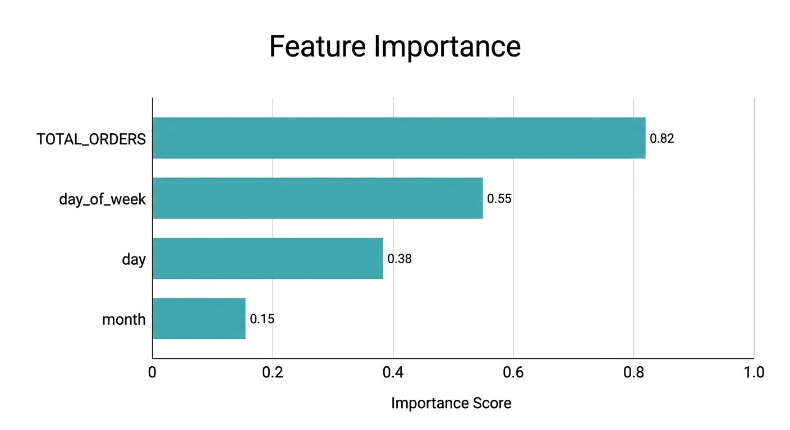

---

## 🔄 ML Pipeline Workflow

```
Snowflake (Gold Layer Data)
        ↓
Python (Data Extraction)
        ↓
Feature Engineering
        ↓
Model Training
        ↓
Model Comparison
        ↓
Best Model Saved
        ↓
Streamlit Dashboard Uses Model
        ↓
User Inputs → Predictions
        ↓
Stored back in Snowflake
```

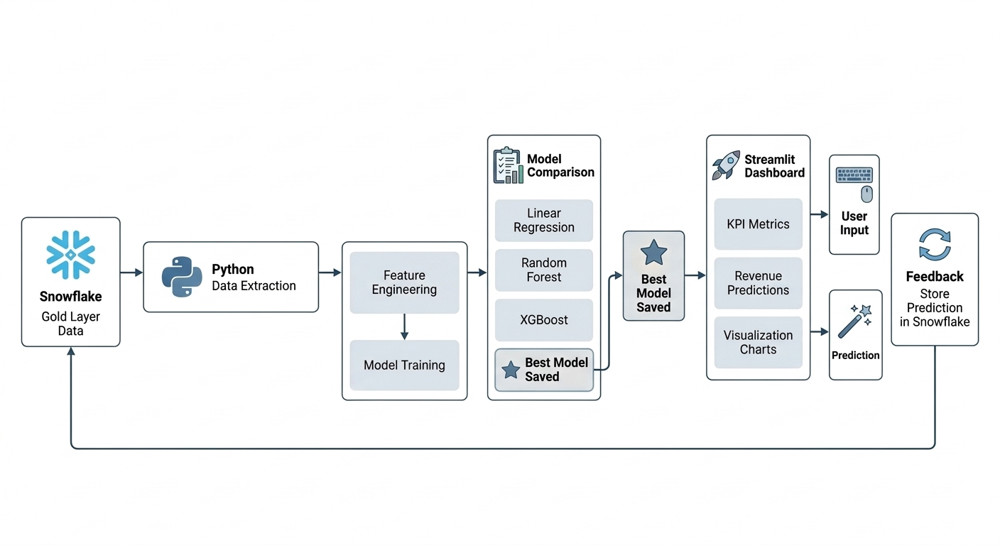

---

## 📁 Project Structure

```
snowflake-medallion-ml-pipeline/
│
├── data/
│   └── daily_revenue.csv
│
├── ml/
│   ├── train_model.py
│   ├── auto_train.py
│   ├── revenue_model.pkl
│
├── streamlit/
│   ├── app.py
│   ├── snowflake_connection.py
│
├── sql/
│   ├── data_engineering_pipeline.sql
│   ├── automation_tasks.sql
│   ├── predictions.sql
│   ├── ml_retrainer.sql
│
├── requirements.txt
├── README.md
```

---

## 📊 Streamlit Dashboard

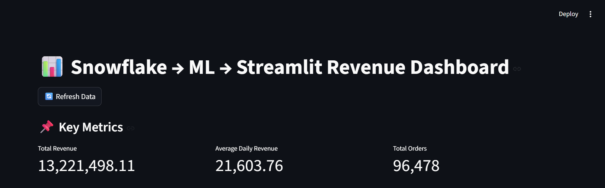
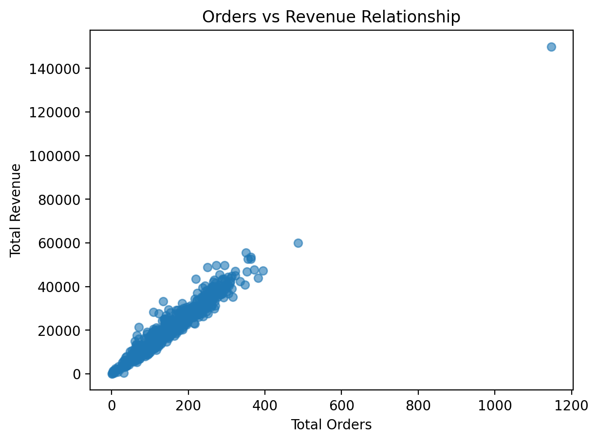
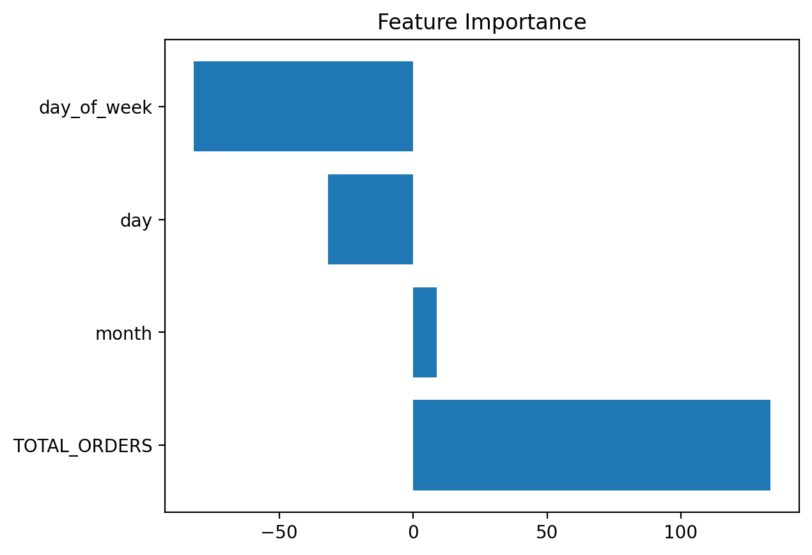
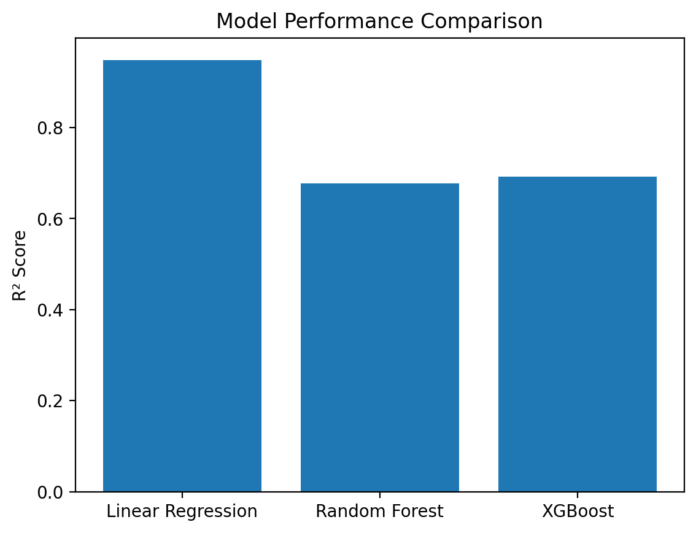
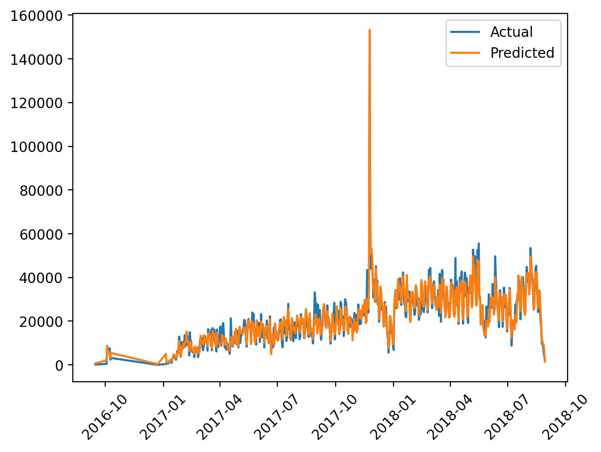
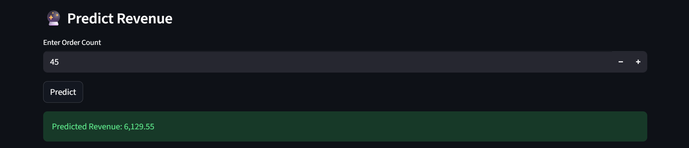

---

## ▶️ How to Run

### 1. Clone Repository
git clone https://github.com/your-username/snowflake-medallion-ml-pipeline.git
cd snowflake-medallion-ml-pipeline

### 2. Create Virtual Environment

python -m venv venv
venv\Scripts\activate

### 2. Install Dependencies

pip install -r requirements.txt

### 4. Run ML Training

python ml/train_model.py

### 5. Run ML Streamlit App

streamlit run streamlit/app.py

## 🔌 Running Without Snowflake (Local Mode)

### If Snowflake is not available, the project can run using the local CSV file:

data/daily_revenue.csv

Modify your function in snowflake_connection.py:

```

def fetch_daily_revenue():
    return pd.read_csv("data/daily_revenue.csv")

```
### You can also disable Snowflake inserts temporarily:

```

def insert_prediction(order_count, predicted_value):
    pass
```

## 📌 Future Enhancements

- Model versioning

- Docker deployment

- Cloud deployment (AWS / Azure)

- Advanced feature engineering

- Real-time streaming pipeline

## 📄 Research Paper

### This project supports the research paper:

"Design and Implementation of a Cloud-Native Medallion Architecture for Scalable Predictive Analytics using Snowflake"

## 👨‍💻 Author

Mohamed Faiz
